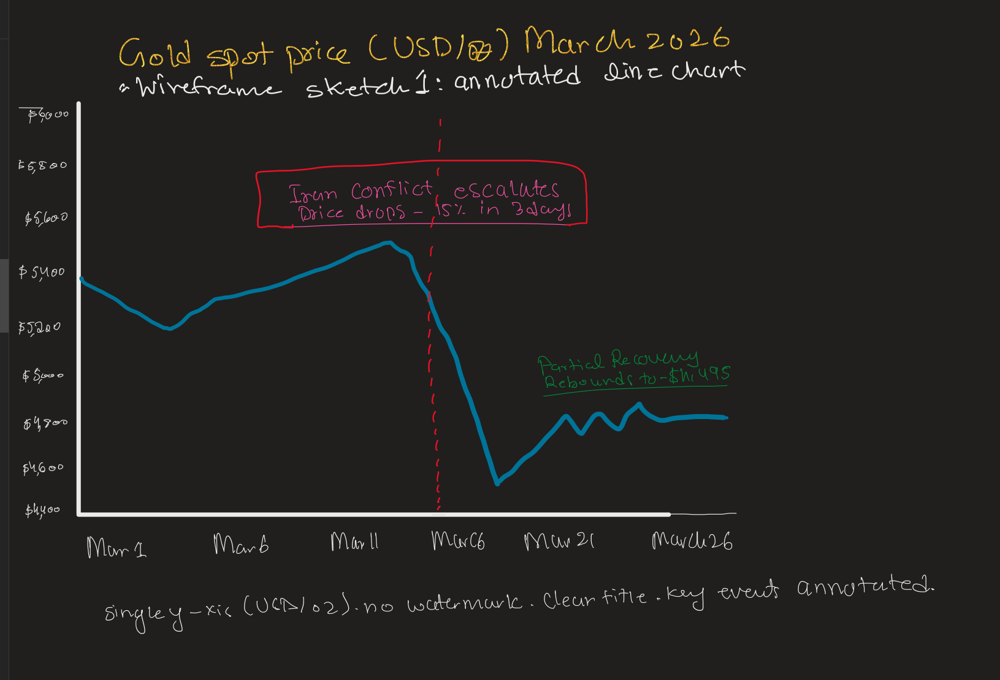
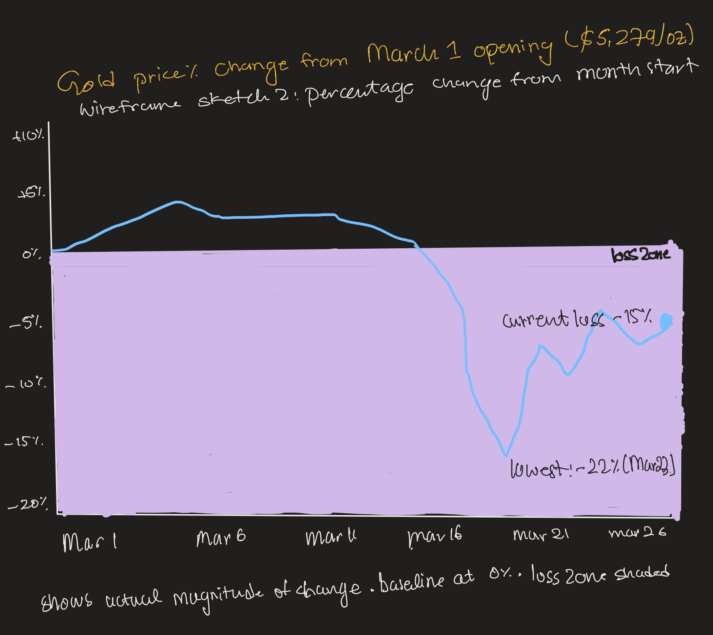

| [home page](https://cmustudent.github.io/tswd-portfolio-templates/) | [data viz examples](dataviz-examples) | [critique by design](critique-by-design) | [final project I](final-project-part-one) | [final project II](final-project-part-two) | [final project III](final-project-part-three) |

# Gold Spot Price Chart
## Step one:

I selected the BullionVault Live Gold Spot Price Chart from MakeoverMonday Week 5, 2026. The chart shows one month of gold prices in March 2026, displayed as a line/area chart with dual y-axes (USD/kg and USD/oz).
I chose this visualization because gold prices experienced a dramatic crash in March 2026 due to the escalating Iran-Israel conflict, and I wanted to see how well the original chart communicated that story. I noticed right away that while the chart showed the price movement, it offered no context or explanation for why prices were moving - which seemed like a missed opportunity for a financial platform whose users are making buying and selling decisions.

Image Source: BullionVault, March 2026

## Step two: The Critique
Using Stephen Few's Data Visualization Effectiveness Profile, I evaluated the chart across seven categories. Here are the key findings:
What worked well: The chart uses a familiar line chart format that most people understand immediately (Intuitiveness: 7/10). The current price is clearly labeled, and the general trend is easy to follow. For a quick price check, the chart does its job.

What didn't work well: The chart has several issues that limit its effectiveness:
Completeness (4/10): There are no annotations explaining the big price drop around March 19-23. The news article below the chart mentions the Iran war and Turkey selling gold reserves, but none of that context appears on the chart itself.

Truthfulness (5/10): The y-axis doesn't start at zero, which makes a roughly 15% price decline look like an even more dramatic crash. While truncated axes are common in financial charts, the visual impression is more alarming than the data warrants.

Perceptibility (5/10): The large "BullionVault" watermark sits directly on top of the data, making it harder to read. Dual y-axes (USD/kg and USD/oz) add unnecessary cognitive load.

Aesthetics (4/10): The watermark, cluttered toolbar, and low-contrast gold/yellow color scheme all hurt the visual presentation.

Engagement (4/10): The chart doesn't tell a story. There are no annotations, narrative elements, or context that would draw a viewer in.

Comparing Few's method to Good Charts: Few's method is more systematic. It forces you to evaluate specific measurable qualities one at a time. The Good Charts method focuses more on whether the chart successfully communicates an idea. I found that Few's method was better for identifying technical problems (truncated axes, poor contrast), while Good Charts was better for thinking about the overall story. One thing missing from Few's method is a category for storytelling or narrative whether the chart helps the audience understand not just the data but the meaning behind it.

## Step three: Sketch a solution

Based on my critique, I focused my redesign on three improvements:  Annotated line chart — A clean line chart with a single y-axis (USD/oz), a descriptive title, and annotations marking the Iran conflict escalation and the subsequent recovery.

Sketch 1

Sketch 2

Percentage change chart - Instead of raw price,I changed the percentage from the start of the month. This fixed the truthfulness issue by showing the actual magnitude of the drop with a clear baseline at 0%.

## Step four: Test the solution

I showed my wireframe sketches to two people and asked for feedback.

Person 1: student, MSPPM program
Understood it was a gold price chart right away
Found the annotations helpful said "I like that it tells me why the price dropped" was confused by sketch 2 (percentage change) — asked what the baseline was suggested adding a data source label

Person 2: student, MISM
Preferred sketch 1 because it shows actual dollar values investors care about. Said the "loss zone" shading in sketch 2 was useful but felt dramatic
Suggested keeping the annotated line chart but adding reference lines for monthly high and low

Patterns: Both preferred sketch 1 (annotated line chart) over sketch 2 (percentage change). Sketch 2 needed more explanation, which goes against the goal of making the chart immediately understandable. Both valued the annotations as a major improvement over the original.

Design changes based on feedback: I decided to go with the annotated line chart approach (sketch 1), add a clear source label, and focus on making the story clear through three key annotations: the crash, the bottom, and the recovery.

## Step five: build the solution
Based on my critique and user feedback, I built the final redesign in Tableau. Here are the key changes I made from the original:
Single y-axis (USD per troy ounce) instead of dual axes — reduces confusion
Clear, descriptive title that tells the viewer what happened before they even look at the data
Three annotations marking the key moments: the Iran conflict crash, the lowest point, and the partial recovery, No watermark obscuring the data, Source citation clearly labeled, Clean line chart with minimal visual clutter
The redesigned chart follows the narrative structure from Chapter 4 of Good Charts: setup (gold prices holding around $5,200), conflict (Iran-Israel conflict causes a crash), and resolution (partial recovery to $4,495).

<noscript></noscript><object class='tableauViz'  style='display:none;'><param name='host_url' value='https%3A%2F%2Fpublic.tableau.com%2F' /> <param name='embed_code_version' value='3' /> <param name='site_root' value='' /><param name='name' value='GoldPricesCrashes15&#47;Sheet1' /><param name='tabs' value='no' /><param name='toolbar' value='yes' /><param name='static_image' value='https:&#47;&#47;public.tableau.com&#47;static&#47;images&#47;Go&#47;GoldPricesCrashes15&#47;Sheet1&#47;1.png' /> <param name='animate_transition' value='yes' /><param name='display_static_image' value='yes' /><param name='display_spinner' value='yes' /><param name='display_overlay' value='yes' /><param name='display_count' value='yes' /><param name='language' value='en-US' /></object>
                

Summary
The original BullionVault chart was functional for a quick price check but missed an opportunity to help its audience — investors — understand what was happening and why. By adding annotations, simplifying the layout, and using a descriptive title, the redesigned chart tells the story of March 2026's gold price crash in a way that is both informative and immediately understandable. The biggest lesson from this process was how much impact simple additions like annotations and a clear title can have on turning raw data into a meaningful narrative.

## AI Usage: 
I used Claude (Anthropic) to help organize my critique responses, clean the raw data file for Tableau. All design decisions and the final Tableau visualization are my own work. 

## References: 
Data source: BullionVault via MakeoverMonday Week 5, 2026.

